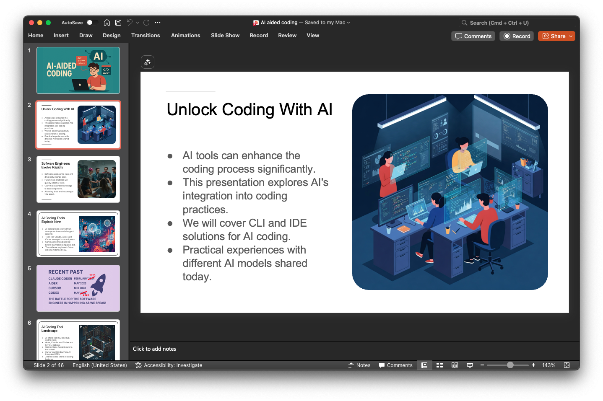
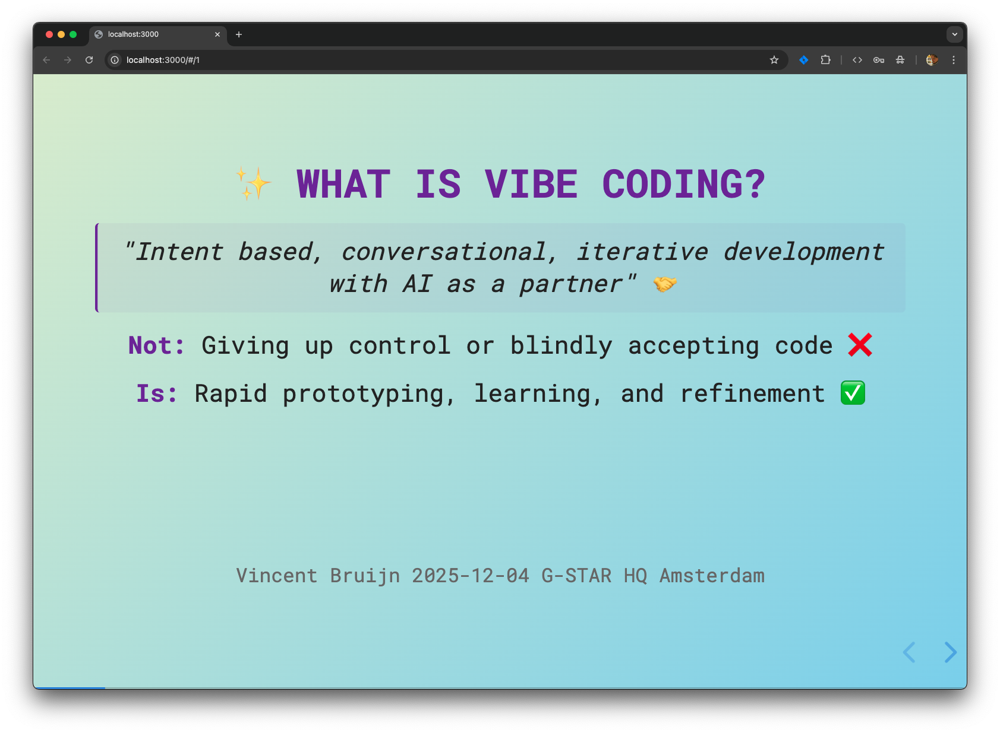
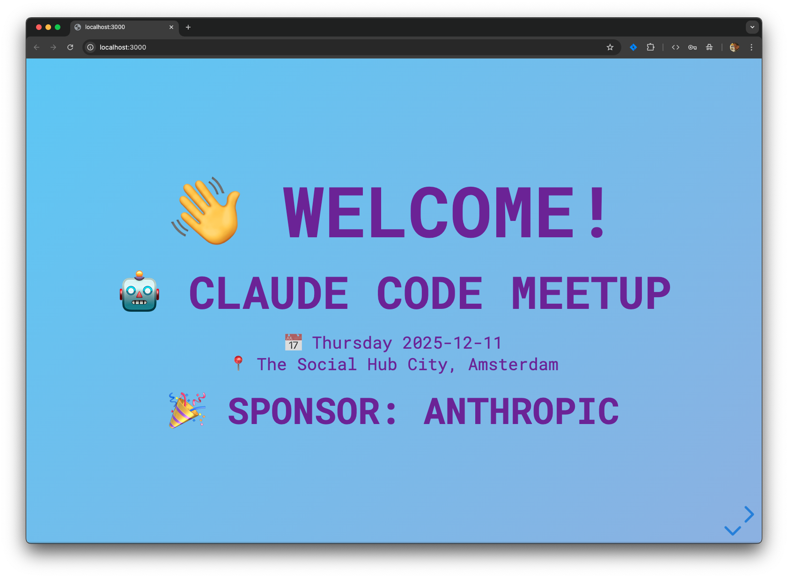

# AI Assisted Coding presentations

I gave 4 presentations on AI assisted coding in 2025

## Dates

- May 27th 2025
	- **Recent discoveries and experiences with AI-aided coding**
	- _G-STAR HQ Amsterdam_
	- Audience consisted mostly of ±20 engineers
- June 21st 2025
	- **Creative Vibe COding**
	- _Mobi, NP3, Suikerlaan Groningen_
	- Audience consisted of ±30 art students
- December 4th 2025
	- **Vibe Coding Tutorial**
	- _G-STAR HQ, Amsterdam_
	- Audience consisted of ±12 colleagues
- December 11th 2025
	- **Claude Code flavors and strategies, How and where can Claude Code shine for you**
	- _Claude Code meetup, The Social Hub City, Amsterdam_
	- Audience consisted of ±50 curious attendees

## Slide examples

(c) 2025 - Vincent Bruijn <vebruijn@gmail.com>

This work is licensed under CC BY-SA 4.0. To view a copy of this license, visit https://creativecommons.org/licenses/by-sa/4.0/